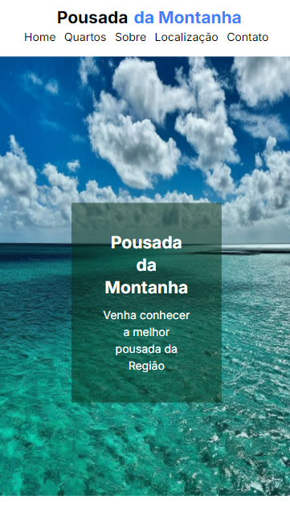
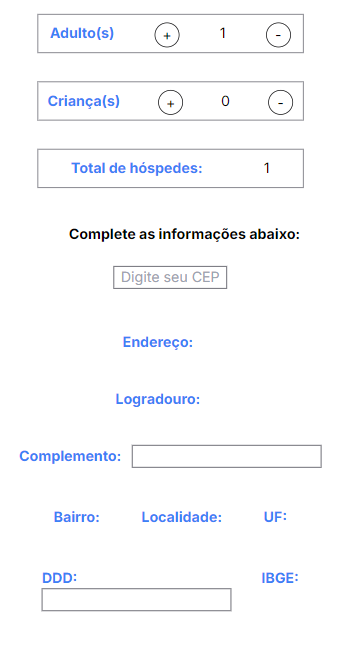
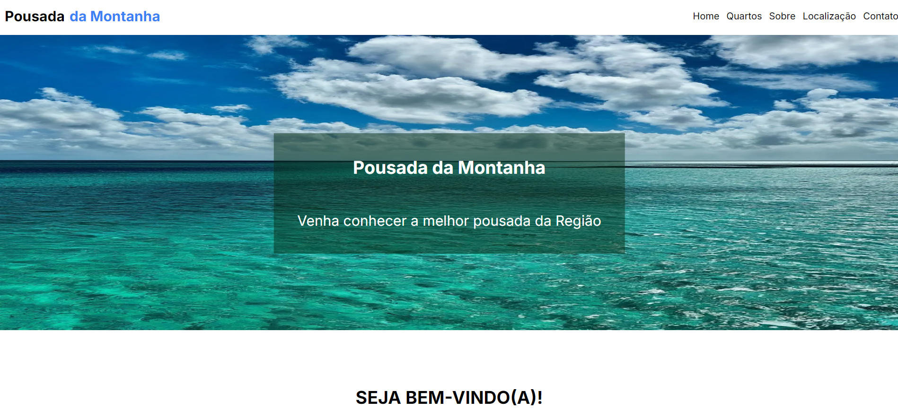
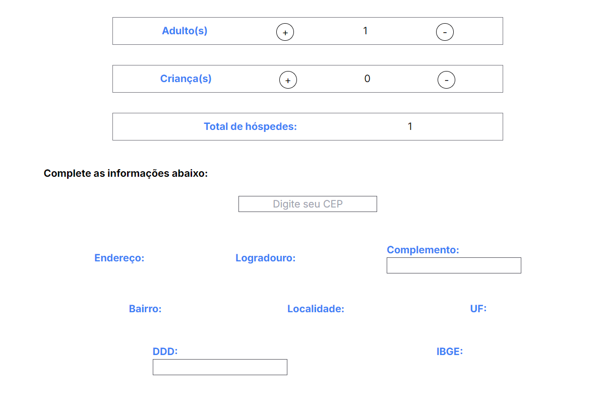

# Sobre o projeto

https://pousadadamontanha.vercel.app/

Este projeto foi desenvolvido usando Next.js e Tailwind CSS para criar um site de uma pousada que oferece uma experiência aconchegante e diversas opções de quartos para seus hóspedes. Ele apresenta várias seções e páginas importantes para os hóspedes conhecerem melhor os serviços da pousada.

Na página principal, o visitante encontra a apresentação da pousada e as opções de quartos disponíveis, que incluem categorias como individual, temático e de casal. Logo em seguida, há um carrossel com feedbacks dos hóspedes e uma seção que destaca as vantagens de escolher a Pousada da Montanha para se hospedar. A página também inclui a localização da pousada e o rodapé com os contatos e um botão que leva o usuário para a página de quartos, onde ele pode escolher a melhor opção de acomodação.

Cada quarto tem uma página dedicada, explicando detalhadamente as vantagens do mesmo, e um botão que leva para a página de reserva.As páginas de reserva são personalizadas conforme o tipo de quarto: o quarto individual possui uma página de reserva diferente dos quartos temáticos e de casal, já que comporta um número diferente de hóspedes. 

Na página de reserva, o usuário pode ver os requisitos de cada quarto, incluindo a capacidade de hóspedes, e selecionar as datas de Check-in e Check-out através de um calendário. Há também uma seção onde o usuário pode adicionar ou remover a quantidade de crianças e adultos, e um contador automático calcula o número total de hóspedes. Além disso, o usuário pode inserir seu CEP, e os campos de endereço são preenchidos automaticamente. Após preencher todas as informações, o usuário pode clicar no botão para confirmar a reserva, momento em que aparece um modal de confirmação e, em seguida, o usuário é redirecionado à página inicial, com toasts informando que a reserva foi realizada com sucesso.Esse fluxo garante uma experiência fluida e intuitiva, tanto para os usuários quanto para os administradores da pousada.


Este projeto foi desenvolvido com o objetivo de proporcionar uma experiência intuitiva e acessível, focada em facilitar os hóspedes a conhecer melhor a pousada e facilitando a forma de fazer a reserva, enquanto oferece uma interface amigável e  informativa.

## Layout mobile
### Imagem da Página Principal  



###  Imagem da Página de Reserva

 


## Layout web
### Imagem da Página Principal 



###  Imagem da Página de Reserva





# Tecnologias utilizadas

## Front end
- HTML 
- TAILWIND CSS
- JAVA SCRIPT
- NEXT.JS


# Como executar o projeto


## Front end web

```bash
# clonar repositório para a sua máquina local.

git clone https://github.com/RRodrigoCordeiro/Pousada.git

# Após o download do repositório,abra o projeto

Navegue até o diretório do projeto

# Faça as instalações das dependências.Este projeto utiliza o Node.js e o npm (ou yarn) para gerenciar as dependências é necessário instalar as dependências necessárias para que o projeto funcione corretamente.

npm install

# Execute o projeto localmente.Com as dependências instaladas e as variáveis de ambiente configuradas, você já pode rodar o projeto localmente.

npm run dev

# O servidor de desenvolvimento será iniciado e você poderá acessar o projeto.

http://localhost:3000

# Entrar no projeto

ctrl + click


```

# Autor

Rodrigo Cordeiro Tavares

https://www.linkedin.com/in/rodrigocordeirot/

